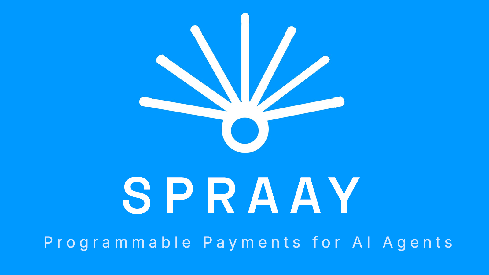

<p align="center">
  
</p>

# Spraay x402 Gateway

[](https://gateway.spraay.app)
[](https://gateway.spraay.app)
[](https://gateway.spraay.app)
[](https://gateway.spraay.app/api/v1/tokens)
[](https://x402.org)
[](https://github.com/plagtech/rtp-spec)
[](https://docs.spraay.app/bpa/1.0/)
[](https://opensource.org/licenses/MIT)

**Batch payments for AI agents — pay up to 200 recipients in one atomic, non-custodial transaction — plus 190 pay-per-use DeFi endpoints across 16 chains.**

The Spraay x402 Gateway is a payment-gated API server where every endpoint costs USDC micropayments via the [x402 protocol](https://x402.org). No API keys. No accounts. Agents pay per request and get data back instantly. Categories span batch payments, payroll, escrow, swaps, oracle, bridge, AI inference, GPU/compute, compute futures, Solana DeFi, Robot Task Protocol (RTP), agent wallets, supply chain (SCTP), research, prediction markets, stocks, and more.

- **Gateway**: [gateway.spraay.app](https://gateway.spraay.app)
- **Solana Gateway**: [gateway-solana.spraay.app](https://gateway-solana.spraay.app)
- **Docs**: [docs.spraay.app](https://docs.spraay.app)
- **Live Dashboard**: [live.spraay.app](https://live.spraay.app)
- **MCP Server**: [Smithery](https://smithery.ai/server/@plagtech/spraay-x402-mcp) · [GitHub](https://github.com/plagtech/spraay-x402-mcp) — 160+ tools
- **HuggingFace Space**: [plagtech/Spraay-gateway](https://huggingface.co/spaces/plagtech/Spraay-gateway) (MCP endpoint included)
- **RTP Spec**: [github.com/plagtech/rtp-spec](https://github.com/plagtech/rtp-spec)
- **BPA 1.0 Spec**: [docs.spraay.app/bpa/1.0](https://docs.spraay.app/bpa/1.0/)
- **Bazaar Discovery**: [gateway.spraay.app/.well-known/x402.json](https://gateway.spraay.app/.well-known/x402.json)
- **Solana Discovery**: [gateway.spraay.app/.well-known/solana.json](https://gateway.spraay.app/.well-known/solana.json)
- **Agent Card (A2A)**: [agent.spraay.app](https://agent.spraay.app/.well-known/agent-card.json)

---

## Ways to Pay

| Method | Details |
|--------|---------|
| **x402 on Base** (default) | USDC micropayments on Base mainnet (`eip155:8453`), facilitated by Coinbase CDP. No API keys. |
| **x402 on Solana** | USDC (SPL) on Solana mainnet-beta via the `X-Solana-Tx` header. Discovery: `/.well-known/solana.json` |
| **x402 on Robinhood Chain** | USDG (Global Dollar, `0x5fc5360D0400a0Fd4f2af552ADD042D716F1d168`) on Robinhood Chain (`eip155:4663`) — same x402 v2 `exact` scheme and EIP-3009 wire format as Base, same USD prices, on every paid endpoint. No approval step, payer needs no ETH; the gateway's own facilitator relays `transferWithAuthorization`. Discovery: `/.well-known/x402.json` → `robinhoodPayment`. |
| **Subscription (Stripe)** | API-key access, no wallet needed. **Starter $29/mo** (1,000 calls/day) · **Pro $99/mo** (10,000 calls/day). All paid endpoints included. [Sign up](https://spraay.app/#pricing) |
| **MPP** 🚧 *under construction* | Machine Payments Protocol (Tempo + Stripe). The `tempo` (pathUSD) and `evm/charge` (USDG on Robinhood Chain, EIP-3009) methods are wired up, but the gateway does not yet emit the `WWW-Authenticate: Payment` challenge on its 402s, so MPP clients can't discover or complete payment. **Use x402 — it's live on all three chains.** [Spec](https://mpp.dev) |

## How x402 Works

1. Client sends request to a gateway endpoint
2. Gateway returns `402 Payment Required` with USDC amount + payment details
3. Client signs a USDC micropayment (Base or Solana) — or a USDG one on Robinhood Chain
4. Gateway validates payment via the Coinbase CDP facilitator (Base/Solana) or its in-process facilitator (Robinhood Chain)
5. Gateway returns requested data

> **Note:** `/.well-known/mpp.json` currently advertises MPP as active. That reflects
> configuration, not a working payment path — see Ways to Pay. MPP discovery is under
> construction and the manifest will be corrected when the challenge flow ships.

---

## 💧 Batch Payments — Core Primitive

Pay up to **200 recipients** in one atomic, non-custodial transaction. Any ERC-20 + native ETH. Implements the open **[BPA 1.0](https://docs.spraay.app/bpa/1.0/)** spec (Batch Payments for Agents). Protocol fee: **0.3%** (30 bps).

| Chain | Batch contract |
|-------|----------------|
| Base | [`0x1646452F98E36A3c9Cfc3eDD8868221E207B5eEC`](https://basescan.org/address/0x1646452F98E36A3c9Cfc3eDD8868221E207B5eEC) |
| Ethereum | `0x15E7aEDa45094DD2E9E746FcA1C726cAd7aE58b3` |
| Arbitrum | `0x5be43aA67804aD84fcb890d0AE5F257fb1674302` |
| Polygon | `0x6d2453ab7416c99aeDCA47CF552695be5789D7ff` |
| BNB Chain | `0x3093a2951FB77b3beDfB8BA20De645F7413432C1` |
| Avalanche | `0x6A41Fb5F5CfE632f9446b548980dA6cE2d75afcC` |
| Unichain | `0x08fA5D1c16CD6E2a16FC0E4839f262429959E073` |
| Plasma | `0x08fA5D1c16CD6E2a16FC0E4839f262429959E073` |
| BOB | `0xEc8599026AE70898391a71c96AA82d4840C2e973` |
| Robinhood Chain | [`0x08fA5D1c16CD6E2a16FC0E4839f262429959E073`](https://robinhoodchain.blockscout.com/address/0x08fA5D1c16CD6E2a16FC0E4839f262429959E073) |
| Stacks | `ST7431QK2YMPP3SQYJXZ3GTB6MJVGF07N2EV9R1F.spraay-batch` |

| Endpoint | Method | Cost |
|----------|--------|------|
| `/api/v1/batch/execute` | POST | $0.02 |
| `/api/v1/batch/estimate` | POST | $0.001 |
| `/api/v1/stellar/batch` | POST | $0.02 |
| `/api/v1/stellar/estimate` | POST | $0.001 |
| `/api/v1/xrp/batch` | POST | $0.02 |
| `/api/v1/xrp/estimate` | POST | $0.001 |
| `/api/v1/xrp/info` | GET | $0.001 |

Free pre-flight: `POST /free/validate-batch` (BPA 1.0 schema validation) and `GET /free/estimate-batch` (rough cost estimate).

## Supported Chains — 16 Mainnet

Base · Ethereum · Solana · Bitcoin · Arbitrum · Polygon · BNB Chain · Avalanche · Unichain · Plasma · BOB · Robinhood Chain · Bittensor · XRP Ledger · Stacks · Stellar

Canton Network is live on **testnet**. Batch payouts settle on the destination chain; x402 API payments settle in USDC on Base or Solana, or USDG on Robinhood Chain.

---

## 🤖 Robot Task Protocol (RTP)

Spraay is the **reference implementation** of [RTP — Robot Task Protocol](https://github.com/plagtech/rtp-spec), an open standard for AI agents to discover, commission, and pay for physical robot tasks via x402.

Any robot, drone, IoT device, or machine can register on the gateway. AI agents discover them via `.well-known/x402.json`, pay USDC per task, and receive standardized results — with escrow handling the payment lifecycle automatically.

| Endpoint | Method | Cost | Description |
|----------|--------|------|-------------|
| `/api/v1/robots/register` | POST | Free | Register a robot with capabilities, pricing, connection config |
| `/api/v1/robots/task` | POST | $0.05 | Dispatch a paid task (x402 + escrow) |
| `/api/v1/robots/complete` | POST | Free | Robot reports task result, triggers escrow release |
| `/api/v1/robots/list` | GET | $0.005 | Discover robots — filter by capability, chain, price |
| `/api/v1/robots/status` | GET | $0.002 | Poll task status (PENDING → DISPATCHED → COMPLETED) |
| `/api/v1/robots/profile` | GET | $0.002 | Full robot capability profile |
| `/api/v1/robots/update` | PATCH | Free | Update robot pricing, capabilities, status |
| `/api/v1/robots/deregister` | POST | Free | Remove robot from network |

**Quick example — register a robot:**
```bash
curl -X POST https://gateway.spraay.app/api/v1/robots/register \
  -H "Content-Type: application/json" \
  -d '{
    "name": "WarehouseBot-01",
    "capabilities": ["pick", "place", "scan"],
    "price_per_task": "0.05",
    "payment_address": "0xYourWallet",
    "connection": { "type": "webhook", "webhookUrl": "https://yourserver.com/rtp/task" }
  }'
```

**Resources:** [RTP 1.0 Spec](https://github.com/plagtech/rtp-spec/blob/main/spec/RTP-1.0.md) · [TypeScript SDK](https://github.com/plagtech/rtp-spec/tree/main/sdk) · [Device Compatibility Guide](https://github.com/plagtech/rtp-spec/blob/main/docs/DEVICE-COMPATIBILITY.md) · [x402 Roadmap Proposal #1569](https://github.com/coinbase/x402/issues/1569)

---

## AI Inference — Dual Provider

OpenAI-compatible chat completions across **200+ models** (streaming, function calling, vision). Agents choose with a single `provider` parameter:

| Provider | Models | Auth | Payment |
|----------|--------|------|---------|
| **OpenRouter** (default) | 50+ models | API key (server-side) | Agent → Spraay (x402) |
| **BlockRun** | 43+ models | x402 wallet (no API key) | Agent → Spraay (x402) → BlockRun (x402) |

### Smart Routing

Set `model: "blockrun/auto"` with `provider: "blockrun"` to let ClawRouter pick the cheapest capable model automatically. Saves up to 78% on inference costs.

```json
{
  "model": "blockrun/auto",
  "messages": [{ "role": "user", "content": "What is x402?" }],
  "provider": "blockrun",
  "routing_profile": "auto"
}
```

**Routing profiles:** `free` (NVIDIA free models) · `eco` (budget optimized) · `auto` (balanced, default) · `premium` (best quality)

Omit `provider` to use OpenRouter (backward compatible). Free tier: `POST /free/chat` (open-weight models).

---

## Endpoints

Full machine-readable catalog: `GET https://gateway.spraay.app` · [Bazaar manifest](https://gateway.spraay.app/.well-known/x402.json)

### AI
| Endpoint | Method | Cost |
|----------|--------|------|
| `/api/v1/chat/completions` | POST | $0.005 |
| `/api/v1/models` | GET | $0.001 |

### DeFi — Swap (MangoSwap router: Uniswap V3 / Aerodrome on Base)
| Endpoint | Method | Cost |
|----------|--------|------|
| `/api/v1/swap/quote` | GET | $0.008 |
| `/api/v1/swap/tokens` | GET | $0.001 |
| `/api/v1/swap/execute` | POST | $0.015 |

### Solana DeFi (Jupiter / Helius / Pyth)
| Endpoint | Method | Cost |
|----------|--------|------|
| `/api/v1/solana/jupiter/quote` | GET | $0.005 |
| `/api/v1/solana/jupiter/swap-tx` | POST | $0.01 |
| `/api/v1/solana/helius/assets-by-owner` | GET | $0.003 |
| `/api/v1/solana/helius/asset` | GET | $0.002 |
| `/api/v1/solana/pyth/price` | GET | $0.005 |
| `/api/v1/solana/pyth/prices` | GET | $0.008 |

### Oracle
| Endpoint | Method | Cost |
|----------|--------|------|
| `/api/v1/oracle/prices` | GET | $0.008 |
| `/api/v1/oracle/gas` | GET | $0.005 |
| `/api/v1/oracle/fx` | GET | $0.008 |

### Bridge (LI.FI)
| Endpoint | Method | Cost |
|----------|--------|------|
| `/api/v1/bridge/quote` | GET | $0.05 |
| `/api/v1/bridge/chains` | GET | $0.002 |

### Payroll
| Endpoint | Method | Cost |
|----------|--------|------|
| `/api/v1/payroll/execute` | POST | $0.10 |
| `/api/v1/payroll/estimate` | POST | $0.003 |
| `/api/v1/payroll/tokens` | GET | $0.002 |

### Invoice — Supabase persistent
| Endpoint | Method | Cost |
|----------|--------|------|
| `/api/v1/invoice/create` | POST | $0.05 |
| `/api/v1/invoice/list` | GET | $0.01 |
| `/api/v1/invoice/:id` | GET | $0.01 |

### Analytics
| Endpoint | Method | Cost |
|----------|--------|------|
| `/api/v1/analytics/wallet` | GET | $0.01 |
| `/api/v1/analytics/txhistory` | GET | $0.008 |

### Escrow — Supabase persistent
| Endpoint | Method | Cost |
|----------|--------|------|
| `/api/v1/escrow/create` | POST | $0.10 |
| `/api/v1/escrow/fund` | POST | $0.02 |
| `/api/v1/escrow/release` | POST | $0.08 |
| `/api/v1/escrow/cancel` | POST | $0.02 |
| `/api/v1/escrow/list` | GET | $0.02 |
| `/api/v1/escrow/:id` | GET | $0.005 |

### AI Inference (on-chain intelligence)
| Endpoint | Method | Cost |
|----------|--------|------|
| `/api/v1/inference/classify-address` | POST | $0.03 |
| `/api/v1/inference/classify-tx` | POST | $0.03 |
| `/api/v1/inference/explain-contract` | POST | $0.03 |
| `/api/v1/inference/summarize` | POST | $0.03 |

### Trust (ProofLayer)
| Endpoint | Method | Cost |
|----------|--------|------|
| `/api/v1/trust/score` | GET | $0.03 |

Multi-dimensional wallet/agent trust score — financial, reliability, trust, and social axes + XMTP reputation + on-chain signals. Powered by [ProofLayer](https://prooflayer.net).

### Communication
| Endpoint | Method | Cost |
|----------|--------|------|
| `/api/v1/notify/email` | POST | $0.01 |
| `/api/v1/notify/sms` | POST | $0.02 |
| `/api/v1/notify/status` | GET | $0.002 |
| `/api/v1/webhook/register` | POST | $0.01 |
| `/api/v1/webhook/test` | POST | $0.005 |
| `/api/v1/webhook/list` | GET | $0.002 |
| `/api/v1/webhook/delete` | POST | $0.002 |
| `/api/v1/xmtp/send` | POST | $0.01 |
| `/api/v1/xmtp/inbox` | GET | $0.01 |

### Infrastructure
| Endpoint | Method | Cost |
|----------|--------|------|
| `/api/v1/rpc/call` | POST | $0.001 |
| `/api/v1/rpc/chains` | GET | $0.001 |
| `/api/v1/storage/pin` | POST | $0.01 |
| `/api/v1/storage/get` | GET | $0.005 |
| `/api/v1/storage/status` | GET | $0.002 |
| `/api/v1/cron/create` | POST | $0.01 |
| `/api/v1/cron/list` | GET | $0.002 |
| `/api/v1/cron/cancel` | POST | $0.002 |
| `/api/v1/logs/ingest` | POST | $0.002 |
| `/api/v1/logs/query` | GET | $0.005 |

### Identity, Compliance & Tax — Supabase persistent
| Endpoint | Method | Cost |
|----------|--------|------|
| `/api/v1/kyc/verify` | POST | $0.02 |
| `/api/v1/kyc/status` | GET | $0.01 |
| `/api/v1/auth/session` | POST | $0.01 |
| `/api/v1/auth/verify` | GET | $0.005 |
| `/api/v1/audit/log` | POST | $0.005 |
| `/api/v1/audit/query` | GET | $0.03 |
| `/api/v1/tax/calculate` | POST | $0.08 |
| `/api/v1/tax/report` | GET | $0.05 |

### Agent Wallets (ERC-4337 on Base)
| Endpoint | Method | Cost |
|----------|--------|------|
| `/api/v1/agent-wallet/provision` | POST | $0.05 |
| `/api/v1/agent-wallet/session-key` | POST | $0.02 |
| `/api/v1/agent-wallet/revoke-key` | POST | $0.02 |
| `/api/v1/agent-wallet/info` | GET | $0.005 |
| `/api/v1/agent-wallet/predict` | GET | $0.001 |
| `/api/v1/wallet/list` | GET | $0.002 |
| `/api/v1/wallet/:walletId` | GET | $0.001 |
| `/api/v1/wallet/:walletId/addresses` | GET | $0.001 |
| `/api/v1/wallet/sign-message` | POST | $0.005 |
| `/api/v1/wallet/send-transaction` | POST | $0.02 |

### GPU / Compute
| Endpoint | Method | Cost |
|----------|--------|------|
| `/api/v1/gpu/run` | POST | $0.06 |
| `/api/v1/gpu/status/:id` | GET | $0.005 |
| `/api/v1/gpu/models` | GET | Free |
| `/api/v1/gpu-direct/run` | POST | $0.03 |
| `/api/v1/compute/text-inference` | POST | $0.003–$0.10 |
| `/api/v1/compute/image-generation` | POST | $0.02–$0.08 |
| `/api/v1/compute/video-generation` | POST | $0.40–$0.50 |
| `/api/v1/compute/text-to-speech` | POST | $0.03–$0.05 |
| `/api/v1/compute/speech-to-text` | POST | $0.02 |
| `/api/v1/compute/embeddings` | POST | $0.005 |
| `/api/v1/compute/batch` | POST | $0.05 (up to 50 jobs, 10% discount) |
| `/api/v1/compute/status/:jobId` | GET | $0.001 |

### Compute Futures (prepaid credits — tier discounts: $10+ → 5%, $50+ → 10%, $200+ → 15%)
| Endpoint | Method | Cost |
|----------|--------|------|
| `/api/v1/compute-futures/deposit` | POST | $0.01 |
| `/api/v1/compute-futures/execute` | POST | $0.001 |
| `/api/v1/compute-futures/balance` | GET | $0.001 |
| `/api/v1/compute-futures/history` | GET | $0.002 |
| `/api/v1/compute-futures/refund` | POST | $0.01 |
| `/api/v1/compute-futures/pricing` | GET | $0.001 |

### Bittensor (decentralized AI — SN64 inference, SN19 image gen)
| Endpoint | Method | Cost |
|----------|--------|------|
| `/bittensor/v1/chat/completions` | POST | $0.03 |
| `/bittensor/v1/images/generations` | POST | $0.05 |
| `/bittensor/v1/embeddings` | POST | $0.005 |
| `/bittensor/v1/models` | GET | $0.001 |

### Image Generation
| Endpoint | Method | Cost |
|----------|--------|------|
| `/api/v1/image/generate` | POST | $0.06 (DALL-E 3, FLUX, SDXL) |
| `/api/v1/image/edit` | POST | $0.05 |
| `/api/v1/image/status/:id` | GET | $0.001 |

### Search / RAG (Tavily)
| Endpoint | Method | Cost |
|----------|--------|------|
| `/api/v1/search/web` | POST | $0.02 |
| `/api/v1/search/extract` | POST | $0.02 |
| `/api/v1/search/qna` | POST | $0.03 |

### Supply Chain — SCTP v0.1
| Endpoint | Method | Cost |
|----------|--------|------|
| `/api/v1/sctp/supplier` | POST | $0.02 |
| `/api/v1/sctp/supplier/:id` | GET | $0.005 |
| `/api/v1/sctp/po` | POST | $0.02 |
| `/api/v1/sctp/po/:id` | GET | $0.005 |
| `/api/v1/sctp/invoice` | POST | $0.02 |
| `/api/v1/sctp/invoice/:id` | GET | $0.005 |
| `/api/v1/sctp/invoice/verify` | POST | $0.03 (AI match vs PO) |
| `/api/v1/sctp/pay` | POST | $0.10 (batch settlement) |

### Research & Reference (23 endpoints, $0.001–$0.002)
Dictionary (define, synonyms, phonetics) · Academic papers via OpenAlex 250M+ (search, by-DOI, by-author, citations, trending) · arXiv preprints (search, by-ID, recent) · Crossref scholarly 150M+ (by-DOI, search, citations-count, journal-info) · PubChem chemistry (compound, similarity, bioactivity) · PubMed biomedical 36M+ (search, by-PMID, related) · US Census + Data.gov demographics — all under `/api/v1/research/*`

### Markets & Stocks
| Endpoint | Method | Cost |
|----------|--------|------|
| `/api/v1/markets/polymarket/events` | GET | $0.001 |
| `/api/v1/markets/polymarket/market/:id` | GET | $0.001 |
| `/api/v1/markets/polymarket/orderbook/:id` | GET | $0.001 |
| `/api/v1/markets/polymarket/trades/:id` | GET | $0.001 |
| `/api/v1/markets/search` | GET | $0.002 |
| `/api/v1/stocks/price` | GET | $0.001 |
| `/api/v1/stocks/search` | GET | $0.001 |
| `/api/v1/stocks/history` | GET | $0.001 |
| `/api/v1/stocks/company` | GET | $0.001 |

### Data & Portfolio
| Endpoint | Method | Cost |
|----------|--------|------|
| `/api/v1/prices` | GET | $0.005 |
| `/api/v1/balances` | GET | $0.005 |
| `/api/v1/resolve` | GET | $0.002 |
| `/api/v1/portfolio/tokens` | GET | $0.008 |
| `/api/v1/portfolio/nfts` | GET | $0.01 |
| `/api/v1/contract/read` | POST | $0.002 |
| `/api/v1/contract/write` | POST | $0.01 |
| `/api/v1/defi/positions` | GET | $0.008 (Aave V3, Compound V3, Aerodrome) |

### Free Tier — 25+ endpoints, no payment required
| Endpoint | Description |
|----------|-------------|
| `GET /` · `/health` · `/stats` | Gateway info, health, statistics |
| `GET /.well-known/x402.json` | Bazaar discovery manifest |
| `GET /api/v1/tokens` | Supported tokens & chains |
| `GET /free` | Free tier catalog |
| `GET /free/gas` | Gas prices — 7 EVM chains (cached 15s) |
| `GET /free/prices` | USDC/ETH/SOL spot prices (cached 60s) |
| `GET /free/chain-status` | Block height & liveness — 7 EVM chains |
| `GET /free/nonce` | EVM nonce / tx count |
| `GET /free/validate-address` | Multi-chain address validation (EVM, Solana, XRP, Stellar) |
| `POST /free/validate-batch` | BPA 1.0 payload schema validation |
| `GET /free/estimate-batch` | Rough batch cost estimate |
| `GET /free/resolve` | ENS & Basename resolution |
| `GET /free/agent-card` | ERC-8004 agent registry lookup |
| `POST /free/x402-check` | Probe any URL for x402 support |
| `GET /free/convert` | Fiat ↔ crypto / unit conversion |
| `GET /free/timestamp` · `/free/uuid` | Utilities |
| `GET /free/dex/*` | DEX pair search, detail, trending (DexScreener) |
| `POST /free/chat` · `GET /free/chat/models` · `GET /free/models` | Free AI chat (open-weight models) + model catalogs |
| RTP: `register`, `complete`, `update`, `deregister` | Robot lifecycle (free) |
| `GET /bittensor/v1/health` | Bittensor health |

---

## Agent Registrations

| Registry | ID / Link |
|----------|-----------|
| **Dexter (ERC-8004)** | Agent #27567 |
| **Virtuals ACP** | Provider on [agdp.io](https://agdp.io) — batch payments as a service |
| **ERC-8004 Agents** | MangoSwap #26345, Spraay #26346 |
| **XMTP** | Agent Mango — inbound/outbound on Fly.io |
| **Bazaar** | [gateway.spraay.app/.well-known/x402.json](https://gateway.spraay.app/.well-known/x402.json) |
| **A2A** | [agent.spraay.app](https://agent.spraay.app/.well-known/agent-card.json) |
| **x402 Roadmap** | [RTP Proposal #1569](https://github.com/coinbase/x402/issues/1569) |

---

## Tech Stack

- **Runtime**: Node.js / Express / TypeScript
- **Protocols**: x402 with Bazaar discovery + [RTP 1.0](https://github.com/plagtech/rtp-spec) + [BPA 1.0](https://docs.spraay.app/bpa/1.0/) · MPP 🚧 under construction
- **Facilitator**: Coinbase CDP (Base, Solana) · in-process EIP-3009 relay for Robinhood Chain (`src/rails/robinhoodUsdg.ts`)
- **Settlement**: USDC on Base mainnet + Solana mainnet-beta · USDG on Robinhood Chain (4663)
- **AI Providers**: BlockRun (`@blockrun/llm` — x402 wallet auth), OpenRouter (API key), Chutes (Bittensor)
- **Database**: Supabase (Postgres) — persistent storage for escrow, invoices, webhooks, cron, auth, KYC, audit, tax, logs, robots, robot_tasks
- **Hosting**: Railway
- **Providers**: Alchemy (multi-chain RPC), Resend (email), Twilio (SMS), Pinata (IPFS), XMTP via Fly.io (messaging), LI.FI (bridge), Tavily (search), Replicate (GPU), Jupiter/Helius/Pyth (Solana), Finnhub (stocks), Polymarket Gamma/CLOB (prediction markets), ProofLayer (trust)

---

## Environment Variables

| Variable | Required | Description |
|----------|----------|-------------|
| `PAY_TO_ADDRESS` | Yes | Wallet to receive USDC payments |
| `X402_NETWORK` | Yes | `eip155:8453` for Base mainnet |
| `SUPABASE_URL` | Yes | Supabase project URL |
| `SUPABASE_KEY` | Yes | Supabase anon key |
| `SUPABASE_SERVICE_KEY` | Yes | Supabase service_role key |
| `OPENROUTER_API_KEY` | Yes | OpenRouter API key for AI (default provider) |
| `BLOCKRUN_WALLET_KEY` | No | Private key for BlockRun x402 payments (enables dual-provider AI) |
| `BLOCKRUN_ENABLED` | No | Set to `"false"` to disable BlockRun (default: enabled if wallet key exists) |
| `ALCHEMY_API_KEY` | Yes | Alchemy API key for multi-chain RPC |
| `PINATA_API_KEY` | Yes | Pinata API key for IPFS |
| `PINATA_API_SECRET` | Yes | Pinata API secret |
| `TAVILY_API_KEY` | Yes | Tavily API key for search |
| `REPLICATE_API_TOKEN` | Yes | Replicate API token for GPU inference |
| `ANTHROPIC_API_KEY` | No | Anthropic key for AI inference classification |
| `PORT` | No | Server port (default: 3402) |
| `FACILITATOR_PRIVATE_KEY_ROBINHOOD` | No | Dedicated relay wallet (ETH on Robinhood Chain 4663) that settles USDG payments. Absent → the rail is still advertised but every USDG payment answers `rail_not_enabled` (never a crash). Never the deployer key. |
| `ROBINHOOD_PAY_TO_ADDRESS` | No | Revenue wallet for USDG settlements (default: `0xdAA0fb4fb470AA8fb53A0c301EF9AADC89949F33`) |
| `ROBINHOOD_RPC_URL` | No | Robinhood Chain RPC (default: `https://rpc.mainnet.chain.robinhood.com`; Alchemy recommended in production) |
| `MPP_ENABLED` | No | 🚧 Under construction. `"true"` activates the MPP middleware, but the challenge flow is incomplete — leave unset unless developing MPP support. |

Additional provider keys (email, SMS, Solana, stocks, Stripe subscriptions, Bittensor/Chutes, and more) are documented in `.env.example` — treat that file as the authoritative list.

---

## Local Development

```bash
git clone https://github.com/plagtech/spraay-x402-gateway
cd spraay-x402-gateway
npm install
cp .env.example .env
# Fill in all environment variables
npm start
```

Verify the live x402 batch-payment flow (402 challenge → EIP-3009 → settlement) end-to-end against `/api/v1/batch/execute` with [`scripts/live_batch_send_smoke.py`](scripts/live_batch_send_smoke.py) (dry-run by default; set `EVM_PRIVATE_KEY` to move real funds). See [`scripts/README.md`](scripts/README.md) for usage and requirements.

---

## Ecosystem

**Merged PRs:**
- [NVIDIA NeMo-Agent-Toolkit-Examples #27](https://github.com/NVIDIA/NeMo-Agent-Toolkit-Examples/pull/27) — complete payment tools (batch, escrow, RTP)
- [Google ADK Community #95](https://github.com/google/adk-python-community/pull/95) — batch payments integration
- [AWS Strands Agents — official docs integration](https://strandsagents.com/docs/integrations/tools/strands-spraay/) — batch payments, up to 200 recipients/tx (merged via strands-agents/docs #825)
- [Goose #7525](https://github.com/aaif-goose/goose/pull/7525) — Spraay Batch Payments MCP extension tutorial
- [awesome-x402 #470](https://github.com/xpaysh/awesome-x402/pull/470) — Spraay Compute & Futures listing
- [coinbase/x402](https://github.com/coinbase/x402) — ecosystem listing
- [punkpeye/awesome-mcp-servers](https://github.com/punkpeye/awesome-mcp-servers)
- [ahmet/awesome-web3 #721](https://github.com/ahmet/awesome-web3/pull/721)


**OpenClaw / ClawHub:**
- **SpraayBatch plugin** — [ClawHub](https://clawhub.com) + npm; batch payments for OpenClaw agents (any ERC-20 on Base)
- 19 published skills including x402 Agent Payments, Spraay Batch Payments, Solana Batch Payments, crypto-payroll, and shopify-batch-payouts — `clawhub install spraay-openclaw`

---

## Related

- **RTP Spec**: [github.com/plagtech/rtp-spec](https://github.com/plagtech/rtp-spec) — Robot Task Protocol v1.0 open standard
- **BPA 1.0**: [docs.spraay.app/bpa/1.0](https://docs.spraay.app/bpa/1.0/) — Batch Payments for Agents open spec
- **MCP Server**: [github.com/plagtech/spraay-x402-mcp](https://github.com/plagtech/spraay-x402-mcp) — 160+ tools, connect any AI agent via MCP
- **HuggingFace Space**: [huggingface.co/spaces/plagtech/Spraay-gateway](https://huggingface.co/spaces/plagtech/Spraay-gateway) — Gradio tools + MCP endpoint
- **Docs**: [docs.spraay.app](https://docs.spraay.app) — Full endpoint catalog
- **Spraay App**: [spraay.app](https://spraay.app) — batch payments UI across 16 chains
- **Live Dashboard**: [live.spraay.app](https://live.spraay.app) — real-time gateway activity
- **Spraay Base App**: [spraay-base-dapp.vercel.app](https://spraay-base-dapp.vercel.app) — Farcaster mini app + onramp
- **StablePay**: [stablepay.me](https://stablepay.me) — crypto payroll dashboard
- **ProofLayer**: [prooflayer.net](https://prooflayer.net) — agent trust scoring
- **MangoSwap**: [mangoswap.xyz](https://mangoswap.xyz) — DEX on Base
- **x402 Protocol**: [x402.org](https://x402.org)
- **BlockRun**: [blockrun.ai](https://blockrun.ai)

## License

MIT
